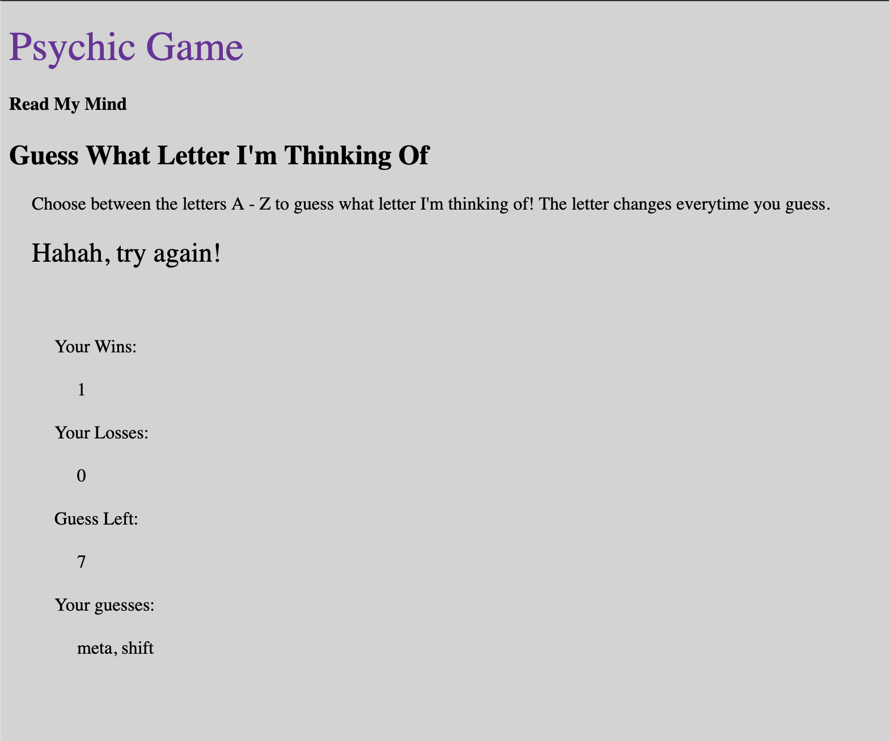
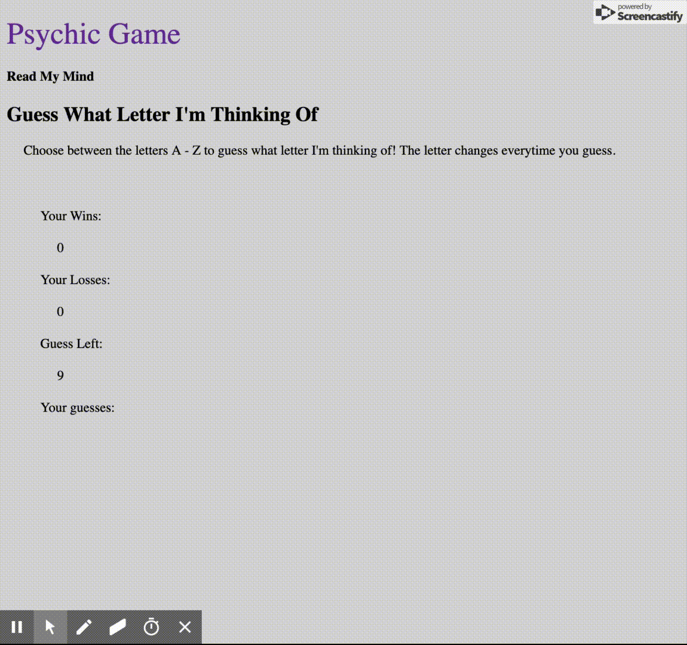

<h1>Psychic-Game</h1>

Example for Psychic Game livesolve.

Link to Game: https://juliezembik.github.io/psychic-game/

***

<h3>Technologies Used</h3>

* HTML5
* CSS3
* Vanilla JavaScript

***

<h3>Description</h3>
Psychic Game is a simple game that randomizes three letters and asks the user to press a key on the keyboard to figure out the randomized letter.

Psychic game is created to demonstrate the use of:

```
1. if else statements
2. functions
3. global variables
4. Randomizing with Math.floor(Math.random())
5. Displaying and refreshing information to the DOM through use of proper JavaScript ordering structure
6. Commentation to describe what each structure/line of code does for students

```

<h3>Images</h3>

Basic image of the Game




Gif of the Game

